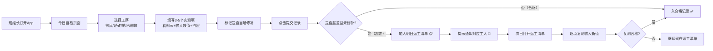

## 1. 产品概述
极简质量自检 App，将复杂工程质检表格转化为劳务班组长可执行的整改清单，解决现场质检记录繁琐、超差项遗漏、返工追踪困难的问题。目标用户为文化水平不一的现场劳务班组长，每日收工前完成自检，次日按清单复测。

- 核心价值：3步完成质检录入（选工序→测数据→拍照片），超差自动入返工清单，闭环管理
- 市场价值：降低劳务班组与项目部的沟通成本，减少因质检遗漏造成的返工损失

## 2. 核心功能

### 2.1 用户角色
| 角色 | 注册方式 | 核心权限 |
|------|----------|----------|
| 劳务班组长 | 无需注册，直接使用 | 选择工序、录入自检数据、拍照上传、标记整改、复测关闭 |

### 2.2 功能模块
1. **今日自检页面**：工序选择卡、实测项录入表单、拍照上传、当场修补标记
2. **返工清单页面**：待返工项列表、工人分配提示、复测入口、合格关闭
3. **合格记录页面**：按日期/工序筛选、历史合格数据浏览

### 2.3 页面详情
| 页面名称 | 模块名称 | 功能描述 |
|-----------|-------------|---------------------|
| 今日自检 | 工序选择区 | 4个大卡片：抹灰🧱、贴砖🔲、地坪🟫、砌筑🏗️，点击选中进入实测 |
| 今日自检 | 实测项列表 | 展示该工序3-5个常用实测项，含名称、允许偏差、测量位置图示、数值输入框 |
| 今日自检 | 照片上传 | 调用手机相机/相册，每项可拍1张现场照片 |
| 今日自检 | 修补标记 | 大按钮切换：已当场修补 ✅ / 未修补 ❌，默认为未修补 |
| 今日自检 | 提交按钮 | 底部超大提交按钮，提交后：合格→入合格记录；超差且未修补→入返工清单 |
| 返工清单 | 日期标签 | 展示"今日待返工"标题，标注需要处理的日期 |
| 返工清单 | 返工项卡片 | 展示工序名、实测项名、原测量值、偏差值、现场照片缩略图、分配工人 |
| 返工清单 | 复测操作 | 点击"去复测"进入复测页，输入新测量值，合格后勾选关闭 |
| 返工清单 | 关闭确认 | 复测合格后弹出大按钮确认，项从列表移入合格记录 |
| 合格记录 | 日期筛选 | 顶部横向滚动日期条，选中后显示当日数据 |
| 合格记录 | 工序筛选 | 4个筛选标签：全部/抹灰/贴砖/地坪/砌筑 |
| 合格记录 | 记录卡片 | 展示工序名、所有实测值、照片缩略图、检查时间 |

## 3. 核心流程

班组长打开App → 进入"今日自检" → 选择负责工序（如抹灰）→ 依次填写3-5个实测项（每项含图示说明测量位置）→ 输入测量数值 → 拍1张现场照片 → 标记是否当场修补 → 点击"提交记录"
→ App判断：若全部合格且标记修补 → 直接入合格记录
→ App判断：若超差且未修补 → 自动加入"明日返工"清单，提示需通知哪位工人
→ 次日打开"返工清单" → 逐项复测 → 输入复测值 → 合格后勾选关闭 → 转入合格记录

## 4. 用户界面设计

### 4.1 设计风格
- **主色调**：工业橙 #E65100（活力、警示、工地感）+ 深灰蓝 #1E293B（稳重、专业）
- **辅助色**：合格绿 #16A34A、超差红 #DC2626、警告黄 #CA8A04
- **按钮风格**：超大圆角（rounded-2xl）、饱满色块、粗边框、点击下沉效果
- **字体**：系统默认无衬线字体（中文清晰易读），正文 18-20px，标题 24-28px，数字输入框 32px 大号加粗
- **布局风格**：卡片式布局（大卡片、大间距）、底部3个Tab导航、顶部简洁标题栏
- **图标风格**：使用 lucide-react 线性图标 + emoji 增强识别（🧱🔲🟫🏗️✅❌📋📷👷）
- **设计原则**：语言极简（每屏文字≤50字）、按钮≥56px高度（易点击）、关键操作视觉突出

### 4.2 页面设计概览
| 页面名称 | 模块名称 | UI元素 |
|-----------|-------------|-------------|
| 今日自检 | 工序选择区 | 4张渐变色大卡片，圆角24px，图标80px，阴影厚，点击缩放+高亮边框 |
| 今日自检 | 实测项卡片 | 白色卡片、阴影、顶部"测量位置图示"SVG区域、中部大号数值输入、底部绿/红状态色条 |
| 今日自检 | 测量图示 | 简洁SVG示意图：墙体/地面轮廓+红/蓝线标注测量位置，配文字"靠尺放这里→" |
| 今日自检 | 照片上传区 | 虚线圆角框 200px×150px，📷大图标，点击后调起手机相机，显示缩略图 |
| 今日自检 | 修补开关 | 超大分段控件：左"未修补 ❌"(红边白底) 右"已修补 ✅"(绿底白字)，宽度占满屏幕 |
| 今日自检 | 提交按钮 | 底部悬浮固定，橙色渐变，高度72px，字号24px，箭头图标→ |
| 返工清单 | 返工项卡片 | 红色左侧边条+白色卡片，照片缩略图右对齐，工人名黄色标签，底部"去复测"绿按钮 |
| 返工清单 | 复测弹窗 | 全屏半透明遮罩，大号数值输入框+照片重拍+确认合格大按钮 |
| 合格记录 | 日期条 | 横向滚动胶囊按钮，选中填橙底白字，未选灰底黑字 |
| 合格记录 | 记录卡片 | 灰色侧边条+白色卡片，工序色点标记，折叠/展开详情 |
| 全局 | 底部Tab导航 | 3个Tab：📋今日自检 / 🔧返工清单 / ✅合格记录，高度64px，选中橙色+粗体 |

### 4.3 响应式
- **设计策略**：Mobile-first 移动端优先设计，主适配 375px-430px 宽度（手机竖屏）
- **触摸优化**：所有可点击元素≥56px高度，按钮左右间距≥16px，避免误触
- **桌面适配**：居中显示模拟手机宽度容器（max-width: 480px），两侧灰色背景，保证手机交互体验
- **输入适配**：数字输入框自动弹出数字键盘（inputMode: numeric），照片上传支持 capture="environment" 调起后置摄像头
