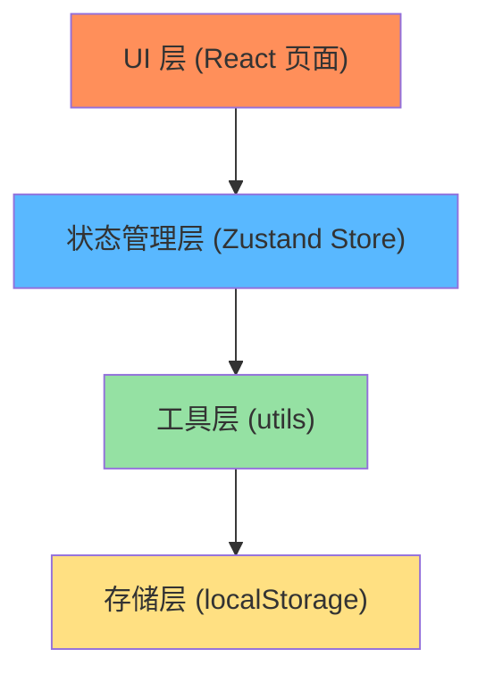
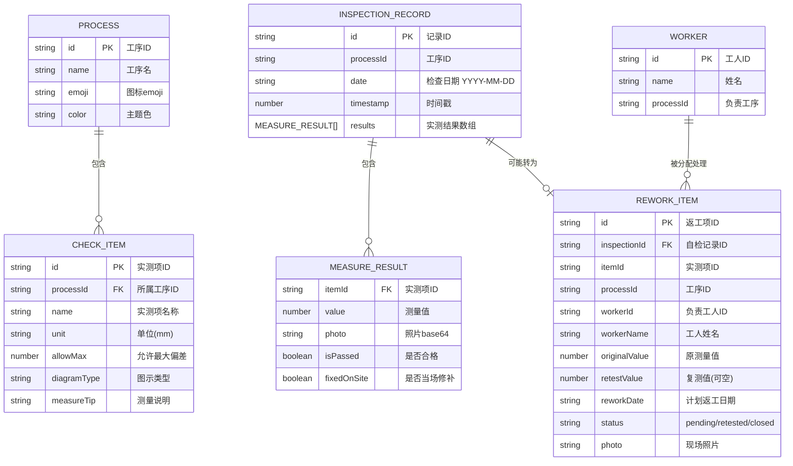

## 1. 架构设计

纯前端应用，无后端服务，数据使用 localStorage 本地持久化存储。



**组件层级：**
- App.tsx → 路由入口（HashRouter）
- layout/AppLayout.tsx → 整体布局（含底部Tab导航）
- pages/DailyCheck.tsx → 今日自检
- pages/ReworkList.tsx → 返工清单
- pages/QualifiedRecords.tsx → 合格记录
- components/ → 可复用组件（工序卡片、实测项卡片、图示组件等）

## 2. 技术描述
- **前端框架**：React@18 + TypeScript@5
- **构建工具**：Vite@5
- **样式方案**：Tailwind CSS@3（原子化CSS，适合快速开发大按钮、卡片布局）
- **状态管理**：Zustand@4（轻量、API简洁，适合中小型应用）
- **路由**：React Router DOM@6（HashRouter 适配静态部署）
- **图标库**：lucide-react（线性图标，符合工地极简风格）
- **数据持久化**：localStorage + zustand persist 中间件
- **无后端**：纯前端实现，照片以 base64 DataURL 存入 localStorage

## 3. 路由定义
| Route | 页面组件 | 用途 |
|-------|---------|------|
| `/` | DailyCheck | 今日自检（默认首页） |
| `/rework` | ReworkList | 返工清单 |
| `/records` | QualifiedRecords | 合格记录 |

## 4. 数据模型

### 4.1 实体关系图



### 4.2 TypeScript 类型定义

```typescript
// 工序枚举
type ProcessType = 'plastering' | 'tiling' | 'flooring' | 'masonry';

// 工序定义
interface Process {
  id: ProcessType;
  name: string;
  emoji: string;
  color: string; // tailwind gradient class
  bgColor: string;
}

// 实测项定义
interface CheckItem {
  id: string;
  processId: ProcessType;
  name: string;
  unit: string;
  allowMax: number; // 允许最大偏差(mm)，绝对值
  diagramType: 'wall-vertical' | 'wall-horizontal' | 'wall-2m' | 'floor-level' | 'floor-2m' | 'brick-plumb' | 'corner-square';
  measureTip: string;
}

// 测量结果
interface MeasureResult {
  itemId: string;
  value: number | null;
  photo: string | null; // base64 dataurl
  fixedOnSite: boolean;
  isPassed: boolean; // |value| <= allowMax
}

// 自检记录（完整提交的一次检查）
interface InspectionRecord {
  id: string;
  processId: ProcessType;
  date: string; // YYYY-MM-DD
  timestamp: number;
  results: MeasureResult[];
}

// 返工状态
type ReworkStatus = 'pending' | 'retest_passed' | 'retest_failed';

// 返工项
interface ReworkItem {
  id: string;
  inspectionId: string;
  itemId: string;
  processId: ProcessType;
  itemName: string;
  workerName: string;
  originalValue: number;
  allowMax: number;
  retestValue: number | null;
  reworkDate: string; // YYYY-MM-DD (明日)
  status: ReworkStatus;
  photo: string | null;
  createdAt: number;
  closedAt: number | null;
}

// 工人（预设几位常见名字）
interface Worker {
  id: string;
  name: string;
  processId: ProcessType;
}
```

### 4.3 工序实测项预设值（核心配置）

| 工序 | 实测项 | 允许偏差(mm) | 图示类型 | 测量说明 |
|------|--------|-------------|----------|----------|
| 🧱抹灰 | 立面垂直度 | ≤4 | wall-vertical | 2m靠尺垂直靠墙，读数 |
| 🧱抹灰 | 表面平整度 | ≤4 | wall-2m | 2m靠尺横向放，塞尺量最大缝 |
| 🧱抹灰 | 阴阳角方正 | ≤4 | corner-square | 方尺靠在阴阳角，读数 |
| 🔲贴砖 | 立面垂直度 | ≤2 | wall-vertical | 2m靠尺垂直靠墙面 |
| 🔲贴砖 | 表面平整度 | ≤2 | wall-2m | 2m靠尺+塞尺 |
| 🔲贴砖 | 接缝高低差 | ≤0.5 | floor-level | 靠尺横放，量两块砖高低 |
| 🟫地坪 | 表面平整度 | ≤4 | floor-2m | 2m靠尺放地面，塞尺测缝隙 |
| 🟫地坪 | 标高偏差 | ≤±10 | floor-level | 水平仪测与基准线高差 |
| 🏗️砌筑 | 墙面垂直度 | ≤5 | wall-vertical | 2m托线板靠墙 |
| 🏗️砌筑 | 表面平整度 | ≤8 | wall-horizontal | 2m靠尺+塞尺 |
| 🏗️砌筑 | 水平灰缝平直度 | ≤10 | wall-horizontal | 拉通线量10皮砖 |

### 4.4 工人预设
```json
[
  { "id": "w1", "name": "张师傅", "processId": "plastering" },
  { "id": "w2", "name": "李师傅", "processId": "tiling" },
  { "id": "w3", "name": "王师傅", "processId": "flooring" },
  { "id": "w4", "name": "赵师傅", "processId": "masonry" }
]
```

## 5. Zustand Store 设计

```typescript
interface QualityStore {
  // 状态
  records: InspectionRecord[];        // 所有自检记录（含合格和待返工）
  reworkItems: ReworkItem[];          // 返工清单
  workers: Worker[];                  // 预设工人列表
  selectedProcess: ProcessType | null; // 当前选中工序（今日自检内状态）
  tempResults: Record<string, MeasureResult>; // 录入中的临时数据

  // Actions
  selectProcess: (p: ProcessType | null) => void;
  updateTempResult: (itemId: string, patch: Partial<MeasureResult>) => void;
  resetTempResults: () => void;
  submitInspection: () => { passed: ReworkItem[] }; // 提交，返回超差生成的返工项列表
  updateReworkRetest: (id: string, value: number, newPhoto?: string) => 'passed' | 'failed';
  closeReworkItem: (id: string) => void;
  getRecordsByDate: (date: string) => InspectionRecord[];
  getReworkByDate: (date: string) => ReworkItem[];
}
```

**持久化配置**：使用 zustand persist，白名单保存 `records`、`reworkItems`，黑名单 `selectedProcess`、`tempResults`（临时状态不存盘）。
